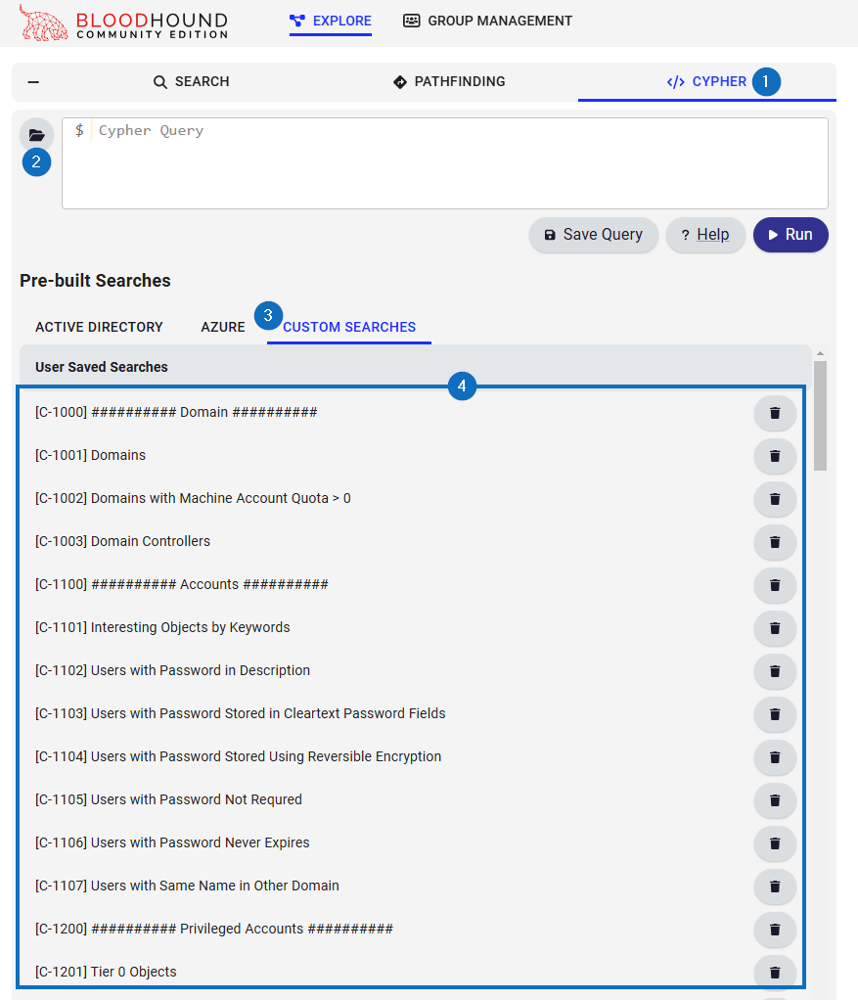

# Compass Security BloodHound CE Resources

This repository contains some useful resources regarding BloodHound CE:

- BloodHound CE Custom Queries [↓](#bloodhound-ce-custom-queries)
- BloodHound Operator Custom Queries [↓](#bloodhound-operator-custom-queries)
- Useful links [↓](#useful-links)

## BloodHound CE Custom Queries

### Direct Usage

You can directly open the [custom
queries](custom_queries/BloodHound_CE_Custom_Queries.md) in your browser and
copy the queries into your BloodHound CE instance.

### Import

#### Initial Preparation

Install PowerShell on Kali:

```bash
sudo apt -y install powershell
```

Clone the BloodHoundOperator repository:

```bash
git clone https://github.com/SadProcessor/BloodHoundOperator.git
```

Create a new API Key in BloodHound via Settings → My Profile → API Key
Management → Create Token.

#### Query Import

Load the BloodHound Operator module, authenticate using the created API tokens
and create a new session:

```powershell
Import-Module /opt/BloodHoundOperator/BloodHoundOperator.ps1

$BHTokenKey = "WW91ciBCbG9vZEhvdW5kIEFQSSBLZXkgY29tZXMgaGVyZSA6KQ=="
$BHTokenID = "596F7572-2054-6F6B-656E-204944203A29"
$BHServer = "127.0.0.1"
$BHPort = "8080"

New-BHSession -Server $BHServer -Port $BHPort -TokenID $BHTokenID -Token (ConvertTo-SecureString -AsPlainText -Force $BHTokenKey)
Get-BHSession
```

For your convinience, so that you don't have to type the commands above every
time, you can copy the
[Create-BloodHoundOperatorSession.ps1](scripts/Create-BloodHoundOperatorSession.ps1)
script, modify it so it matches the values of your
installation and import it:

```powershell
Import-Module /opt/Create-BloodHoundOperatorSession.ps1
```

After creating the session, execute the import script to import the queries:

```powershell
cd scripts
.\Import-BloodHoundCECustomQueries.ps1
```

The imported queries are then shown in BloodHound:



## BloodHound Operator Custom Queries

First, authenticate to the BloodHound API as explained above. Then, just
copy-paste the queries from the
[BloodHound_Operator_Custom_Queries.md](custom_queries/BloodHound_Operator_Custom_Queries.md)
file.

## Useful Links

### BloodHound

- BloodHound Documentation: https://support.bloodhoundenterprise.io/hc/en-us
- BloodHound Documentation:
  https://support.bloodhoundenterprise.io/hc/en-us/sections/16600947632923-Nodes
- BloodHound GitHub: https://github.com/SpecterOps/BloodHound
- SharpHound GitHub: https://github.com/SpecterOps/SharpHound

### Neo4J Cypher

- Neo4J: Cypher Manual: https://neo4j.com/docs/cypher-manual
- Neo4J: Cypher Cheat Sheet: https://neo4j.com/docs/cypher-cheat-sheet/
- Cypher Queries in BloodHound Enterprise:
  https://posts.specterops.io/cypher-queries-in-bloodhound-enterprise-c7221a0d4bb3
- BloodHound: Searching with Cypher:
  https://support.bloodhoundenterprise.io/hc/en-us/articles/16721164740251-Searching-with-Cypher
